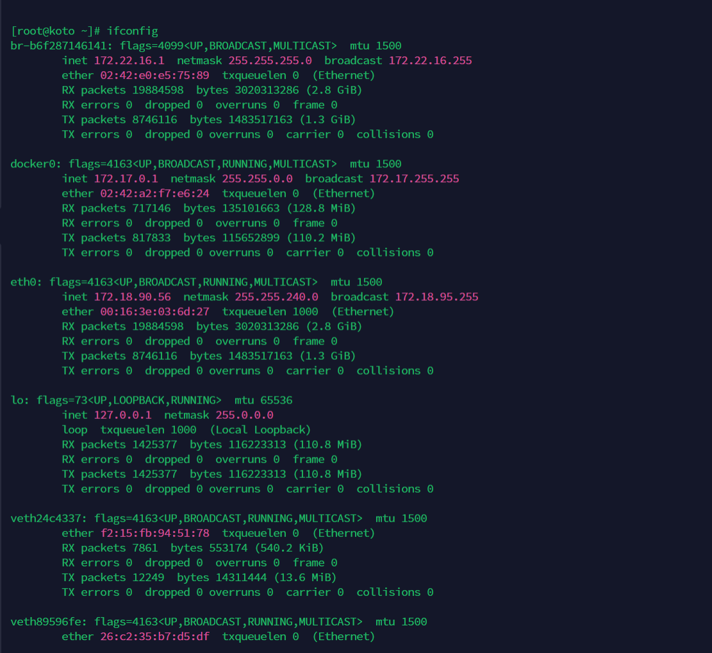
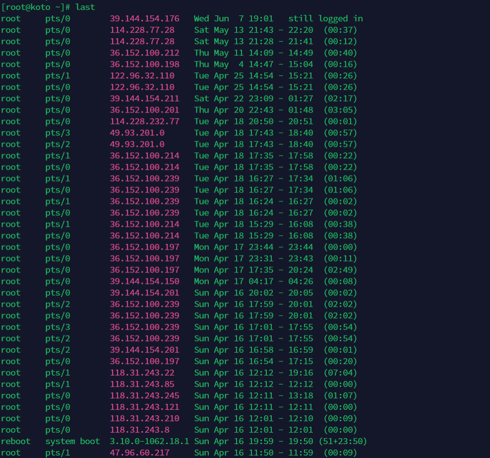

## 实验一、Linux系统的文本处理

### 1.1 文本编辑工具vim

#### vim的三种操作模式

vim有三种操作模式，分别是命令模式（Command mode）、输入模式（Insert mode）和底线命令模式（Last line mode）。

三种模式切换快捷键：

| 模式         | 快捷键 |
| ------------ | ------ |
| 命令模式     | ESC    |
| 输入模式     | i或a   |
| 底线命令模式 | :      |

- 命令模式

在命令模式中控制光标移动和输入命令，可对文本进行复制、粘贴、删除和查找等工作。

使用命令vim filename后进入编辑器视图后，默认模式就是命令模式，此时敲击键盘字母会被识别为一个命令，例如在键盘上连续敲击两次d，就会删除光标所在行。

以下是在命令模式中常用的快捷操作：

| 操作                                                         | 快捷键               |
| ------------------------------------------------------------ | -------------------- |
| 光标左移                                                     | h                    |
| 光标右移                                                     | l（小写L）           |
| 光标上移                                                     | k                    |
| 光标下移                                                     | j                    |
| 光标移动到下一个单词                                         | w                    |
| 光标移动到上一个单词                                         | b                    |
| 移动游标到第n行                                              | nG                   |
| 移动游标到第一行                                             | gg                   |
| 移动游标到最后一行                                           | G                    |
| 快速回到上一次光标所在位置                                   | Ctrl+o               |
| 删除当前字符                                                 | x                    |
| 删除前一个字符                                               | X                    |
| 删除整行                                                     | dd                   |
| 删除一个单词                                                 | dw或daw              |
| 删除至行尾                                                   | d$或D                |
| 删除至行首                                                   | d^                   |
| 删除到文档末尾                                               | dG                   |
| 删除至文档首部                                               | d1G                  |
| 删除n行                                                      | ndd                  |
| 删除n个连续字符                                              | nx                   |
| 将光标所在位置字母变成大写或小写                             | ~                    |
| 复制游标所在的整行                                           | yy（3yy表示复制3行） |
| 粘贴至光标后（下）                                           | p                    |
| 粘贴至光标前（上）                                           | P                    |
| 剪切                                                         | dd                   |
| 交换上下行                                                   | ddp                  |
| 替换整行，即删除游标所在行并进入插入模式                     | cc                   |
| 撤销一次或n次操作                                            | u{n}                 |
| 撤销当前行的所有修改                                         | U                    |
| 恢复撤销操作                                                 | Ctrl+r               |
| 整行将向右缩进                                               | >>                   |
| 整行将向左退回                                               | <<                   |
| 若档案没有更动，则不储存离开，若档案已经被更动过，则储存后离开 | ZZ                   |

- 输入模式

在命令模式下按i或a键就进入了输入模式，在输入模式下，您可以正常的使用键盘按键对文本进行插入和删除等操作。

- 底线命令模式

在命令模式下按:键就进入了底线命令模式，在底线命令模式中可以输入单个或多个字符的命令。

| 操作                                                       | 命令                                    |
| ---------------------------------------------------------- | --------------------------------------- |
| 保存                                                       | :w                                      |
| 退出                                                       | :q                                      |
| 保存并退出                                                 | :wq（:wq!表示强制保存退出）             |
| 将文件另存为其他文件名                                     | :w new_filename                         |
| 显示行号                                                   | :set nu                                 |
| 取消行号                                                   | :set nonu                               |
| 使本行内容居中                                             | :ce                                     |
| 使本行文本靠右                                             | :ri                                     |
| 使本行内容靠左                                             | :le                                     |
| 向光标之下寻找一个名称为word的字符串                       | :/word                                  |
| 向光标之上寻找一个字符串名称为word的字符串                 | :?word                                  |
| 重复前一个搜寻的动作                                       | :n                                      |
| 从第一行到最后一行寻找word1字符串，并将该字符串取代为word2 | :1,$s/word1/word2/g或 :%s/word1/word2/g |

#### 使用示例

在本示例将使用vim在文本文件中写入一首唐诗。

\1. 新建一个文件并进入vim命令模式（因为涉及中文需要您自行点击右下角进行中英文切换）。

```
vim 静夜思.txt
```


\2. 按下i进入输入模式，输入《静夜思》的诗名。


\3. 按下ECS键回到命令模式，并输入底线命令:ce，使诗名居中。


\4. 按下o键换行并进入输入模式，输入第一行诗。


\5. 按下ECS键回到命令模式，并输入底线命令:ce，使第一行诗居中。


\6. 按下o键换行并进入输入模式，输入第二行诗。


\7. 按下ECS键回到命令模式，并输入底线命令:ce，使第二行诗居中。


\8. 在命令模式中执行底线命令:wq离开vim

### 1.2 文本文件查看命令

#### cat

命令描述：cat命令用于查看内容较少的纯文本文件。

命令格式：`cat [选项] [文件]`。

命令参数说明：

| 参数                  | 说明                                             |
| --------------------- | ------------------------------------------------ |
| -n或--number          | 显示行号                                         |
| -b或--number-nonblank | 显示行号，但是不对空白行进行编号                 |
| -s或--squeeze-blank   | 当遇到有连续两行以上的空白行，只显示一行的空白行 |

命令使用示例：

1. 将一个自增序列写入test.txt文件中。

```
for i in $(seq 1 10); do echo $i >> test.txt ; done
```


2. 查看文件内容。

```
 cat test.txt
```


命令输出结果：


3. 将文件内容清空。

```
cat /dev/null > test.txt
```


4. 再次检查文件内容。

```
cat test.txt
```


命令输出结果：


#### more

命令描述：more命令从前向后分页显示文件内容。

常用操作命令：

| 操作                    | 作用                          |
| ----------------------- | ----------------------------- |
| Enter                   | 向下n行，n需要定义，默认为1行 |
| Ctrl+F或空格键（Space） | 向下滚动一页                  |
| Ctrl+B                  | 向上滚动一页                  |
| =                       | 输出当前行的行号              |
| !命令                   | 调用Shell执行命令             |
| q                       | 退出more                      |

命令使用示例：

从第20行开始分页查看系统日志文件/var/log/messages。

```
more +20 /var/log/messages
```


命令输出结果：


#### less

命令描述：less命令可以对文件或其它输出进行分页显示，与moe命令相似，但使用 less 可以随意浏览文件，而 more 仅能向前移动，却不能向后移动。

命令格式：`less [参数] 文件 `。

命令参数说明：

| 参数 | 说明                       |
| ---- | -------------------------- |
| -e   | 当文件显示结束后，自动离开 |
| -m   | 显示类似more命令的百分比   |
| -N   | 显示每行的行号             |
| -s   | 显示连续空行为一行         |

命令常用操作：

| 快捷键               | 说明               |
| -------------------- | ------------------ |
| /字符串              | 向下搜索字符串     |
| ?字符串              | 向上搜索字符串     |
| n                    | 重复前一个搜索     |
| N                    | 反向重复前一个搜索 |
| b或`pageup`键        | 向上翻一页         |
| 空格键或`pagedown`键 | 向下翻一页         |
| u                    | 向前翻半页         |
| d                    | 向后翻半页         |
| y                    | 向前滚动一行       |
| 回车键               | 向后滚动一行       |
| q                    | 退出less命令       |

命令使用示例：

查看命令历史使用记录并通过less分页显示。

```
history | less
```

#### head

命令描述：head命令用于查看文件开头指定行数的内容。

命令格式：`head [参数] [文件]`。

命令参数说明：

| 参数        | 说明                                                         |
| ----------- | ------------------------------------------------------------ |
| -n [行数]   | 显示开头指定行的文件内容，默认为10                           |
| -c [字符数] | 显示开头指定个数的字符数                                     |
| -q          | 不显示文件名字信息，适用于多个文件，多文件时默认会显示文件名 |

命令使用示例：

查看/etc/passwd文件的前5行内容。

```
head -5 /etc/passwd
```


命令输出结果：


#### tail

命令描述：tail命令用于查看文档的后N行或持续刷新内容。

命令格式：`tail [参数] [文件]`。

命令参数说明：

| 参数        | 说明                                   |
| ----------- | -------------------------------------- |
| -f          | 显示文件最新追加的内容                 |
| -q          | 当有多个文件参数时，不输出各个文件名   |
| -v          | 当有多个文件参数时，总是输出各个文件名 |
| -c [字节数] | 显示文件的尾部n个字节内容              |
| -n [行数]   | 显示文件的尾部n行内容                  |

命令使用示例：

查看/var/log/messages系统日志文件的最新10行，并保持实时刷新。

```
tail -f -n 10 /var/log/messages
```


按`ctrl+c`键退出文本实时查看界面。

#### stat

命令描述：用来显示文件的详细信息，包括inode、atime、mtime、ctime等。

命令使用示例：

查看/etc/passwd文件的详细信息。

```
stat /etc/passwd
```


命令输出结果：


#### wc

命令描述：wc命令用于统计指定文本的行数、字数、字节数。

命令格式：`wc [参数] [文件]`。

命令参数说明：

| 参数 | 说明         |
| ---- | ------------ |
| -l   | 只显示行数   |
| -w   | 只显示单词数 |
| -c   | 只显示字节数 |

命令使用示例：

统计/etc/passwd文件的行数。

```
wc -l /etc/passwd
```


命令输出结果：


#### file

命令描述： file命令用于辨识文件类型。

命令格式：`file [参数] [文件]`。

命令参数说明：

| 参数      | 说明                                                         |
| --------- | ------------------------------------------------------------ |
| -b        | 列出辨识结果时，不显示文件名称                               |
| -c        | 详细显示指令执行过程，便于排错或分析程序执行的情形           |
| -f [文件] | 指定名称文件，其内容有一个或多个文件名称时，让file依序辨识这些文件，格式为每列一个文件名称 |
| -L        | 直接显示符号连接所指向的文件类别                             |

命令使用示例：

查看/var/log/messages文件的文件类型。

```
file /var/log/messages
```


命令输出结果：


#### diff

命令描述：diff命令用于比较文件的差异。

命令使用示例：

\1. 构造两个相似的文件

```
echo -e '第一行\n第二行\n我是log1第3行\n第四行\n第五行\n第六行' > 1.log
echo -e '第一行\n第二行\n我是log2第3行\n第四行' > 2.log
```


\2. 分别查看两个文件

\3. 使用diff查看两个文件的差异


对比结果中的3c3表示两个文件在第3行有不同，5,6d4表示2.log文件相比1.log文件在第4行处开始少了1.log文件的第5和第6行。

### 1.3 文本文件处理命令

#### grep

命令描述：grep命令用于查找文件里符合条件的字符串。

grep全称是Global Regular Expression Print，表示全局正则表达式版本，它能使用正则表达式搜索文本，并把匹配的行打印出来。

在Shell脚本中，grep通过返回一个状态值来表示搜索的状态：

- 0：匹配成功。
- 1：匹配失败。
- 2：搜索的文件不存在。

命令格式：`grep [参数] [正则表达式] [文件]`。

命令常用参数说明：

| 参数                    | 说明                                             |
| ----------------------- | ------------------------------------------------ |
| -c或--count             | 计算符合样式的列数                               |
| -d recurse或-r          | 指定要查找的是目录而非文件                       |
| -e [范本样式]           | 指定字符串做为查找文件内容的样式                 |
| -E 或 --extended-regexp | 将样式为延伸的正则表达式来使用                   |
| -F 或 --fixed-regexp    | 将样式视为固定字符串的列表                       |
| -G 或 --basic-regexp    | 将样式视为普通的表示法来使用                     |
| -i 或 --ignore-case     | 忽略字符大小写的差别                             |
| -n 或 --line-number     | 在显示符合样式的那一行之前，标示出该行的列数编号 |
| -v 或 --revert-match    | 显示不包含匹配文本的所有行                       |

命令使用示例：

- 查看sshd服务配置文件中监听端口配置所在行编号。

  ```
  grep -n Port /etc/ssh/ssh_config
  ```

  

  命令输出结果：

  

- 查询字符串在文本中出现的列数。

  ```
  grep -c localhost /etc/hosts
  ```

  

  命令输出结果：

  

- 反向查找，不显示符合条件的行。

  ```
  ps -ef | grep sshd
  ```

  

  ```
  ps -ef | grep -v grep | grep sshd
  ```

  

   命令输出结果：

  

- 以递归的方式查找目录下含有关键字的文件。

  ```
  grep -r *.sh /etc
  ```

  

  命令输出结果：

  

- 使用正则表达式匹配httpd配置文件中异常状态码响应的相关配置。

  ```
  grep 'ntp[0-9].aliyun.com' /etc/ntp.conf
  ```

  

  命令输出结果：

  

#### sed

命令描述：sed是一种流编辑器，它是文本处理中非常中的工具，能够完美的配合正则表达式使用。

\1. 处理时，把当前处理的行存储在临时缓冲区中，称为模式空间（pattern space）。
\2. 接着用sed命令处理缓冲区中的内容，处理完成后，把缓冲区的内容送往屏幕。
\3. 接着处理下一行，这样不断重复，直到文件末尾。

注意：

- sed命令不会修改原文件，例如删除命令只表示某些行不打印输出，而不是从原文件中删去。
- 如果要改变源文件，需要使用-i选项。

命令格式：`sed [参数] [动作] [文件]`。 

参数说明：

| 参数            | 说明                                 |
| --------------- | ------------------------------------ |
| -e [script]     | 执行多个script                       |
| -f [script文件] | 执行指定script文件                   |
| -n              | 仅显示script处理后的结果             |
| -i              | 输出到原文件，静默执行（修改原文件） |

动作说明：

| 动作 | 说明             |
| ---- | ---------------- |
| a    | 在行后面增加内容 |
| c    | 替换行           |
| d    | 删除行           |
| i    | 在行前面插入     |
| p    | 打印相关的行     |
| s    | 替换内容         |

命令使用示例：

- 删除第3行到最后一行内容。

  ```
  sed '3,$d' /etc/passwd
  ```

  

  命令输出结果：

  

- 在最后一行新增行。

  ```
  sed '$a admin:x:1000:1000:admin:/home/admin:/bin/bash' /etc/passwd
  ```

  

  命令输出结果：

  

- 替换内容。

  ```
  sed 's/SELINUX=disabled/SELINUX=enforcing/' /etc/selinux/config
  ```

  

  命令输出结果：

  

- 替换行。

  ```
  sed '1c abcdefg' /etc/passwd
  ```

  

  命令输出结果：

  

#### awk

命令描述：和 sed 命令类似，awk 命令也是逐行扫描文件（从第 1 行到最后一行），寻找含有目标文本的行，如果匹配成功，则会在该行上执行用户想要的操作；反之，则不对行做任何处理。

命令格式：`awk [参数] [脚本] [文件]`。

参数说明：

| 参数       | 说明                                                         |
| ---------- | ------------------------------------------------------------ |
| -F fs      | 指定以fs作为输入行的分隔符，awk 命令默认分隔符为空格或制表符 |
| -f file    | 读取awk脚本                                                  |
| -v val=val | 在执行处理过程之前，设置一个变量var，并给其设置初始值为val   |

内置变量：

| 变量 | 用途                                             |
| ---- | ------------------------------------------------ |
| FS   | 字段分隔符                                       |
| $n   | 指定分隔的第n个字段，如$1、$3分别表示第1、第三列 |
| $0   | 当前读入的整行文本内容                           |
| NF   | 记录当前处理行的字段个数（列数）                 |
| NR   | 记录当前已读入的行数                             |
| FNR  | 当前行在源文件中的行号                           |

awk中还可以指定脚本命令的运行时机。默认情况下，awk会从输入中读取一行文本，然后针对该行的数据执行程序脚本，但有时可能需要在处理数据前运行一些脚本命令，这就需要使用BEGIN关键字，BEGIN会在awsk读取数据前强制执行该关键字后指定的脚本命令。

和BEGIN关键字相对应，END关键字允许我们指定一些脚本命令，awk会在读完数据后执行它们。

命令使用示例：

- 查看本机IP地址。

  ```
  ifconfig eth0 |awk '/inet/{print $2}'
  ```

  

  命令输出结果：

  

- 查看本机剩余磁盘容量。

  ```
  df -h |awk '/\/$/{print $4}'
  ```

  

  命令输出结果：

  

- 统计系统用户个数。

  ```
  awk -F: '$3<1000{x++} END{print x}' /etc/passwd
  ```

  

  命令输出结果：

  

- 输出其中登录Shell不以nologin结尾（对第7个字段做!~反向匹配）的用户名、登录Shell信息。

  ```
  awk -F: '$7!~/nologin$/{print $1,$7}' /etc/passwd
  ```

  

  命令输出结果：

  

- 输出/etc/passwd文件中前三行记录的用户名和用户uid。

  ```
  head -3 /etc/passwd | awk  'BEGIN{FS=":";print "name\tuid"}{print $1,"\t"$3}END{print "sum lines "NR}'
  ```

  

  命令输出结果：

  

- 查看tcp连接数。

  ```
  netstat -na | awk '/^tcp/ {++S[$NF]} END {for(a in S) print a, S[a]}'
  ```

  

  命令输出结果：

  

- 关闭指定服务的所有的进程。

  ```
  ps -ef | grep httpd | awk {'print $2'} | xargs kill -9
  ```

  

#### cut

命令描述：cut命令主要用来切割字符串，可以对输入的数据进行切割然后输出。

命令格式：`cut [参数] [文件]`。

参数说明：

| 参数 | 说明                       |
| ---- | -------------------------- |
| -b   | 以字节为单位进行分割       |
| -c   | 以字符为单位进行分割       |
| -d   | 自定义分隔符，默认为制表符 |

命令使用示例：

- 按字节进行切割。


-  按字符进行切割。


- 按指定字符进行切割。


#### tr

命令描述：tr命令用于对来自标准输入的字符进行替换、压缩和删除。

命令格式：`tr [参数] [文本]`。

参数说明：

| 参数                         | 说明                                                       |
| ---------------------------- | ---------------------------------------------------------- |
| -c                           | 反选指定字符                                               |
| -d                           | 删除指定字符                                               |
| -s                           | 将重复的字符缩减成一个字符                                 |
| -t [第一字符集] [第二字符集] | 删除第一字符集较第二字符集多出的字符，使两个字符集长度相等 |

命令使用示例：

- 将输入字符由大写转换为小写。

  ```
  echo "HELLO WORLD" | tr 'A-Z' 'a-z'
  ```

  

  命令输出结果：

  

- 删除字符。

  ```
  echo "hello 123 world 456" | tr -d '0-9'
  ```

  

  命令输出结果：

  

- 压缩字符。

  ```
  echo "thissss is      a text linnnnnnne." | tr -s ' sn'
  ```

  

  命令输出结果：

  

- 产生随机密码。

  ```
  cat /dev/urandom | tr -dc a-zA-Z0-9 | head -c 13
  ```

  

  命令输出结果：

  

## 实验二、Linux系统管理

### 2.1 常用系统工作命令

#### echo

命令描述：echo命令用于在终端输出字符串或变量提取后的值。

命令格式：echo [字符串 | $变量]

命令用法示例：

- 显示普通字符串
- 显示变量

首先在shell环境中定义一个临时变量name。

```
export name="Tom"
```


使用echo命令将变量name的值显示到终端。

```
echo $name
```


输出结果：


- 显示结果定向至文件

以下命令会将文本This is a test text.输出重定向到文件test.txt中，如果文件已存在，将会覆盖文件内容，如果不存在则创建。其中>符号表示输出重定向。

```
echo "This is a test text." > test.txt
```


如果您希望将文本追加到文件内容最后，而不是覆盖它，请使用>>输出追加重定向符号。

- 显示命令执行结果

以下命令将会在终端显示当前的工作路径。

```
echo `pwd`
```


使用$(command)形式可以达到相同效果。

```
echo $(pwd)
```


输出结果：


#### date

命令描述：date命令用于显示和设置系统的时间和日期。

命令格式：date [选项] [+格式]

其中，时间格式的部分控制字符解释如下：

| 字符 | 说明                                                        |
| ---- | ----------------------------------------------------------- |
| %a   | 当地时间的星期名缩写（例如： 日，代表星期日）               |
| %A   | 当地时间的星期名全称 （例如：星期日）                       |
| %b   | 当地时间的月名缩写 （例如：一，代表一月）                   |
| %B   | 当地时间的月名全称 （例如：一月）                           |
| %c   | 当地时间的日期和时间 （例如：2005年3月3日 星期四 23:05:25） |
| %C   | 世纪；比如 %Y，通常为省略当前年份的后两位数字（例如：20）   |
| %d   | 按月计的日期（例如：01）                                    |
| %D   | 按月计的日期；等于%m/%d/%y                                  |
| %F   | 完整日期格式，等价于 %Y-%m-%d                               |
| %j   | 按年计的日期（001-366）                                     |
| %p   | 按年计的日期（001-366）                                     |
| %r   | 当地时间下的 12 小时时钟时间 （例如：11:11:04 下午）        |
| %R   | 24 小时时间的时和分，等价于 %H:%M                           |
| %s   | 自UTC 时间 1970-01-01 00:00:00 以来所经过的秒数             |
| %T   | 时间，等于%H:%M:%S                                          |
| %U   | 一年中的第几周，以周日为每星期第一天（00-53）               |
| %x   | 当地时间下的日期描述 （例如：12/31/99）                     |
| %X   | 当地时间下的时间描述 （例如：23:13:48）                     |
| %w   | 一星期中的第几日（0-6），0 代表周一                         |
| %W   | 一年中的第几周，以周一为每星期第一天（00-53）               |

命令用法示例：

- 按照默认格式查看当前系统时间

```
date
```


输出结果：


- 按照指定格式查看当前系统时间

```
date "+%Y-%m-%d %H:%M:%S"
```


输出结果：


- 查看今天是当年中的第几天

```
date "+%j"
```


输出结果：


- 将系统的当前时间设置为2020年02月20日20点20分20秒

```
date -s "20200220 20:20:20"
```


输出结果：


- 校正系统时间，与网络时间同步

a. 安装ntp校时工具

```
yum -y install ntp
```


b. 用ntpdate从时间服务器更新时间

```
ntpdate time.nist.gov
```


输出结果：


#### wget

命令描述：在终端中下载文件。

命令格式：wget [参数] 下载地址

参数说明：

| 参数 | 作用                                 |
| ---- | ------------------------------------ |
| -b   | 后台下载                             |
| -P   | 下载到指定目录                       |
| -t   | 最大重试次数                         |
| -c   | 断点续传                             |
| -p   | 下载页面内所有资源，包括图片、视频等 |
| -r   | 递归下载                             |

命令使用示例：

下载一张图片到路径/root/static/img/中，-p参数默认值为当前路径，如果指定路径不存在会自动创建。

```
wget -P /root/static/img/ http://img.alicdn.com/tfs/TB1.R._t7L0gK0jSZFxXXXWHVXa-2666-1500.png
```


输出结果：


#### ps

命令描述：ps命令用于查看系统中的进程状态。

命令格式：ps [参数]。

命令参数说明：

| 参数 | 作用                                               |
| ---- | -------------------------------------------------- |
| -a   | 显示现行终端机下的所有程序，包括其他用户的程序     |
| -u   | 以用户为主的格式来显示程序状况                     |
| -x   | 显示没有控制终端的进程，同时显示各个命令的具体路径 |
| -e   | 列出程序时，显示每个程序所使用的环境变量           |
| -f   | 显示当前所有的进程                                 |
| -t   | 指定终端机编号，并列出属于该终端机的程序的状况     |

命令使用示例：

```
ps -ef | grep sshd
```


输出结果：


#### top

命令描述：top命令动态地监视进程活动与系统负载等信息。

命令使用示例：

```
top
```


输出结果：


命令输出参数解释：

以上命令输出视图中分为两个区域，一个统计信息区，一个进程信息区。

- 统计信息区
  - 第一行信息依次为：系统时间、运行时间、登录终端数、系统负载（三个数值分别为1分钟、5分钟、15分钟内的平均值，数值越小意味着负载越低）。
  - 第二行信息依次为：进程总数、运行中的进程数、睡眠中的进程数、停止的进程数、僵死的进程数。
  - 第三行信息依次为：用户占用资源百分比、系统内核占用资源百分比、改变过优先级的进程资源百分比、空闲的资源百分比等。
  - 第四行信息依次为：物理内存总量、内存使用量、内存空闲量、作为内核缓存的内存量。
  - 第五行信息依次为：虚拟内存总量、虚拟内存使用量、虚拟内存空闲量、预加载内存量。
- 进程信息区

| 列名    | 含义                                                         |
| ------- | ------------------------------------------------------------ |
| PID     | 进程ID                                                       |
| USER    | 进程所有者的用户名                                           |
| PR      | 进程优先级                                                   |
| NI      | nice值。负值表示高优先级，正值表示低优先级                   |
| VIRT    | 进程使用的虚拟内存总量，单位kb                               |
| RES     | 进程使用的、未被换出的物理内存大小，单位kb                   |
| SHR     | 共享内存大小，单位kb                                         |
| S       | 进程状态D：不可中断的睡眠状态R：正在运行S：睡眠T：停止Z：僵尸进程 |
| %CPU    | 上次更新到现在的CPU时间占用百分比                            |
| %MEM    | 进程使用的物理内存百分比                                     |
| TIME+   | 进程使用的CPU时间总计，单位1/100秒                           |
| COMMAND | 命令名                                                       |


按 q 键退出监控页面。

#### pidof

命令描述：pidof命令用于查询指定服务进程的PID值。

命令格式：pidof [服务名称]。

命令参数说明：

| 参数 | 说明                                                   |
| ---- | ------------------------------------------------------ |
| -s   | 仅返回一个进程号                                       |
| -c   | 只显示运行在root目录下的进程，这个选项只对root用户有效 |
| -o   | 忽略指定进程号的进程                                   |
| -x   | 显示由脚本开启的进程                                   |

命令使用示例：

查询出crond服务下的所有进程ID。

```
pidof crond
```


输出结果：


#### kill

命令描述：kill命令用于终止指定PID的服务进程。

kill可将指定的信息送至程序。预设的信息为SIGTERM(15)，可将指定程序终止。若仍无法终止该程序，可使用SIGKILL(9)信息尝试强制删除程序。

命令格式：kill [参数] [进程PID]。

命令使用示例：

删除pid为1247的进程。

```
kill -9 1247
```


#### killall

命令描述：killall命令用于终止指定名称的服务对应的全部进程。

命令格式：killall [进程名称]。

命令使用示例：

删除crond服务下的所有进程。

```
killall crond
```

### 2.2 系统状态检测命令

#### ifconfig

命令描述：ifconfig命令用于获取网卡配置与网络状态等信息。

命令使用示例：

- 获取网卡配置与网络状态等信息。

```
ifconfig
```




命令输出说明：

- 第一部分的第一行显示网卡状态信息。
  - eth0表示第一块网卡。
  - UP代表网卡开启状态。
  - RUNNING代表网卡的网线被接上。
  - MULTICAST表示支持组播。
- 第二行显示网卡的网络信息。
  - inet（IP地址）：172.16.132.195。
  - broadcast（广播地址）：172.16.143.255。
  - netmask（掩码地址）：255.255.240.0。
- RX表示接收数据包的情况，TX表示发送数据包的情况。
- lo表示主机的回环网卡，是一种特殊的网络接口，不与任何实际设备连接，而是完全由软件实现。与回环地址（127.0.0.0/8 或 ::1/128）不同，回环网卡对系统显示为一块硬件。任何发送到该网卡上的数据都将立刻被同一网卡接收到。

#### uname

命令描述：uname命令用于查看系统内核与系统版本等信息。

命令语法：uname [-amnrsv][--help][--version]

命令使用示例：

- 显示系统信息。

```
uname -a
```


命令输出结果：


- 显示当前系统的硬件架构。

```
uname -i
```


命令输出结果：


- 显示操作系统发行编号。

```
uname -r
```


命令输出结果：


- 显示操作系统名称。

```
uname -s
```


命令输出结果：


- 显示主机名称。

```
uname -n
```


命令输出结果：


#### uptime

命令描述：uptime 用于查看系统的负载信息。

命令使用示例：

- 查看系统的负载信息。

```
uptime
```


命令输出说明：

| 负载信息           | 命令输出值                                                   |
| ------------------ | ------------------------------------------------------------ |
| 当前服务器时间     | 14:20:27                                                     |
| 当前服务器运行时长 | 2 min                                                        |
| 当前用户数         | 2 users                                                      |
| 当前负载情况       | load average: 0.03, 0.04, 0.02（分别取1min，5min，15min的均值） |

#### free

命令描述：free用于显示当前系统中内存的使用量信息。

命令语法：free [-bkmotV][-s <间隔秒数>]

命令参数说明：

| 参数 | 说明                                                         |
| ---- | ------------------------------------------------------------ |
| -b   | 以Byte为单位显示内存使用情况                                 |
| -k   | 以KB为单位显示内存使用情况                                   |
| -m   | 以MB为单位显示内存使用情况                                   |
| -h   | 以合适的单位显示内存使用情况，最大为三位数，自动计算对应的单位值。 |

命令使用示例：

- 显示当前系统中内存的使用量信息。

```
free -h
```


命令输出说明：

| 参数       | 说明                                          |
| ---------- | --------------------------------------------- |
| total      | 物理内存总数                                  |
| used       | 已经使用的内存数                              |
| free       | 空间的内存数                                  |
| share      | 多个进程共享的内存总额                        |
| buff/cache | 应用使用内存数                                |
| available  | 可用的内存数                                  |
| Swap       | 虚拟内存（阿里云ECS服务器默认不开启虚拟内存） |

#### who

命令描述：who 命令显示关于当前在本地系统上的所有用户的信息。

命令使用示例：

- 显示当前登录系统的用户

```
who
```


- 显示用户登录来源

```
who -l -H
```


- 只显示当前用户

```
who -m -H
```


- 精简模式显示

```
who -q
```


## 

#### last

命令描述： last 命令用于显示用户最近登录信息。

命令使用示例：

- 显示用户最近登录信息。

```
last
```




由于这些信息都是以日志文件的形式保存在系统中，黑客可以很容易地对内容进行篡改，所以该命令输出的信息并不能作为服务器是否被入侵的依据。

#### history

命令描述：history命令用于显示历史执行过的命令。

bash默认记录1000条执行过的历史命令，被记录在~/.bash_history文件中。

命令使用示例：

- 显示最新10条执行过的命令。

```
history 10
```


- 清除历史记录。

```
history -c
```

## 实验三、Linux系统的磁盘管理

### 3.1 磁盘管理命令

#### df

df命令描述：该命令检查文件系统的磁盘空间占用情况。可以利用该命令来获取硬盘被占用了多少空间，目前还剩下多少空间等信息。

df命令语法：

```
df [参数] [目录或文件名]
```


参数说明：

| 参数 | 说明                                                 |
| ---- | ---------------------------------------------------- |
| -a   | 列出所有的文件系统，包括系统特有的/proc等文件系统。  |
| -k   | 以KBytes为单位，返回各文件系统容量。                 |
| -m   | 以MBytes为单位，返回各文件系统容量。                 |
| -h   | 以GBytes、MBytes、KBytes为单位，返回各文件系统容量。 |
| -H   | 以M=1000K取代M=1024K的进位方式显示各文件系统容量。   |
| -T   | 显示文件系统类型。                                   |
| -i   | 显示inode信息。                                      |

df命令使用示例：

示例一：显示磁盘使用情况。

执行如下命令，显示磁盘使用情况。

```
df
```


返回结果如下所示。


示例二：以inode模式来显示磁盘使用情况。

执行如下命令，以inode模式来显示磁盘使用情况。

```
df -i
```


返回结果如下所示。


示例三：显示系统内的所有特殊文件格式、名称及磁盘使用情况。

执行如下命令，显示系统内的所有特殊文件格式、名称及磁盘使用情况。

```
df -aT
```


返回结果如下所示。


示例四：以GBytes、MBytes、KBytes等格式显示各文件系统容量。

执行如下命令，以GBytes、MBytes、KBytes等格式显示各文件系统容量。

```
df -h
```


返回结果如下所示。


#### du

du命令描述：查看磁盘使用空间。du与df命令不同点在于，du命令用于查看文件和目录磁盘的使用空间。

du命令语法：

```
du [参数] [文件或目录名称]
```


参数说明：

| 参数 | 说明                        |
| ---- | --------------------------- |
| -a   | 列出所有的文件与目录容量。  |
| -h   | 以G、M、K为单位，返回容量。 |
| -s   | 列出总量。                  |
| -S   | 列出不包括子目录下的总量。  |
| -k   | 以KBytes为单位，返回容量。  |
| -m   | 以MBytes为单位，返回容量。  |

du命令使用示例：

示例一：列出当前目录下的所有文件夹的容量。

执行如下命令，列出当前目录下的所有文件夹的容量。

```
du
```


返回结果如下所示。


示例二：列出当前目录下的所有文件夹和文件的容量。

执行如下命令，列出当前目录下的所有文件夹和文件的容量。

```
du -a
```


返回结果如下所示。


示例三：列出当前目录下的所有文件夹和文件的容量，并以G、M、K格式显示容量。

执行如下命令，列出当前目录下的所有文件夹和文件的容量。

```
du -ah
```


返回结果如下所示。


示例四：列出根目录底下每个目录所占用的容量，并以MBytes单位显示容量。

执行如下命令，列出根目录底下每个目录所占用的容量，并以MBytes单位显示容量。

```
du -sm /*
```


返回结果如下所示。


#### fdisk

fdisk命令描述：该命令用于磁盘分区。

fdisk命令语法：

```
fdisk [-l] 装置名称
```


参数说明：

| 参数 | 说明                                                         |
| ---- | ------------------------------------------------------------ |
| -l   | 输出后面装置名称的所有的分区内容。若仅有 fdisk -l时， 则系统将会把整个系统内能够搜寻到的装置的分区均列出来。 |

fdisk命令使用示例：

示例一：列出系统所有装置的分区信息。

执行如下命令，列出系统所有装置的分区信息。

```
fdisk -l
```


返回结果如下所示。


示例二：列出系统中的根目录所在磁盘，并查阅该硬盘内的相关信息。

a. 执行如下命令，找出根目录所在磁盘名。

```
df /
```


返回结果如下所示。


b. 执行如下命令，对磁盘/dev/vda进行分区操作。

```
fdisk /dev/vda
```


**注意：**

对磁盘进行分区操作时，磁盘名不包含数字。

返回结果如下所示。


c. 执行如下命令，获取帮助。

```
m
```


返回结果如下所示。


执行如下命令，查看磁盘状态。

```
p
```


返回结果如下所示，您可以查看到磁盘的相关状态。


d. 执行如下命令，不存储任何操作并离开。

```
q
```